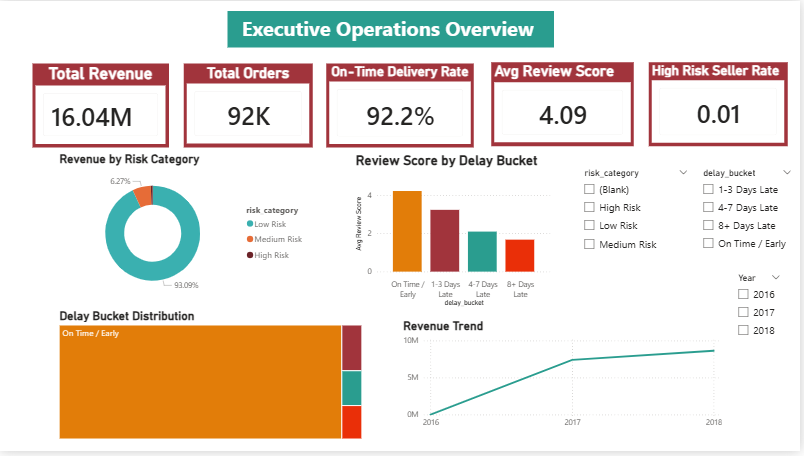
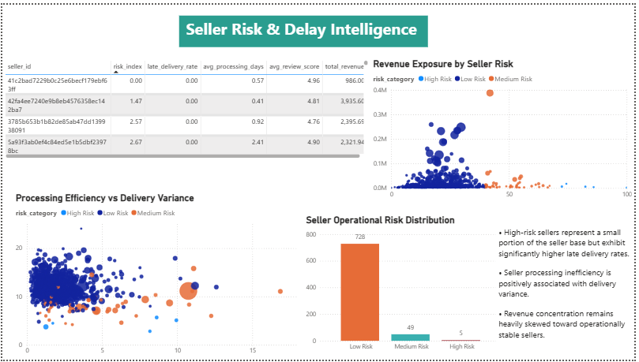

# Seller Fulfillment Delay & Revenue Impact Intelligence System

End-to-end operational analytics and seller risk intelligence project using SQL, Python, Statistical Analysis, and Power BI to identify fulfillment inefficiencies, quantify delivery risk, measure customer experience impact, and support operational escalation monitoring.

---

# Business Problem

E-commerce platforms often face major operational challenges such as:

- Delivery delays
- Seller fulfillment inefficiencies
- Poor customer review experience
- Revenue exposure from unreliable sellers
- Operational bottlenecks
- Lack of seller risk visibility

These issues negatively impact:
- customer satisfaction,
- operational reliability,
- seller performance,
- and long-term platform trust.

This project builds a complete operational intelligence system to:

- Identify seller operational risks
- Analyze fulfillment inefficiencies
- Quantify delivery variance
- Measure customer review impact
- Detect operational escalation risks
- Support operational monitoring and decision-making

---

# Project Objectives

This project answers:

- Which sellers contribute most to delivery inefficiencies?
- How does seller processing impact delivery performance?
- How do operational delays affect customer satisfaction?
- Which sellers pose operational and financial risk?
- How much revenue is exposed to operational instability?
- Which sellers require operational escalation monitoring?

---

# Tech Stack

- SQL (MySQL)
- Python
- Pandas
- NumPy
- SciPy
- Scikit-learn
- Matplotlib
- Seaborn
- Power BI
- VS Code
- GitHub
- Git LFS

---

# Dataset Overview

The project uses the Brazilian E-Commerce Public Dataset by Olist containing:

- Orders data
- Seller data
- Customer data
- Product data
- Payment data
- Review data
- Fulfillment timestamps
- Delivery timelines

Dataset Source:

- Olist Brazilian E-Commerce Dataset  
  https://www.kaggle.com/datasets/olistbr/brazilian-ecommerce

---

# Project Workflow

## 1. Data Ingestion & SQL Pipeline

Raw datasets were loaded into MySQL and integrated into a centralized operational analytics environment.

Datasets processed:

- Orders dataset
- Order items dataset
- Order reviews dataset
- Customers dataset
- Sellers dataset
- Payments dataset
- Product dataset

---

## 2. Data Cleaning & Validation

Comprehensive validation and cleaning performed for:

- Null value handling
- Duplicate validation
- Referential integrity validation
- Timestamp validation
- Invalid delivery logic detection
- Carrier pickup validation
- Delivery inconsistency checks
- Extreme outlier validation

Operational anomalies identified:
- Delivered before purchase timestamps
- Carrier pickup before approval timestamps
- Fulfillment inconsistencies

---

## 3. Operational Feature Engineering

Operational metrics engineered using SQL:

- Seller processing days
- Delivery delay days
- Approval delay hours
- Estimated delivery days
- Actual delivery days
- Late delivery indicators
- Order value aggregation
- Seller operational metrics

---

## 4. Operational Base Table Creation

A robust analytical base table was created by combining:

- Orders
- Sellers
- Reviews
- Revenue metrics
- Fulfillment timelines
- Delivery performance metrics

The final operational table was optimized for:

- Statistical analysis
- Operational intelligence
- Risk modeling
- Dashboarding
- Monitoring pipelines

---

# Exploratory Data Analysis (EDA)

Key analyses performed:

## Delivery Performance Analysis
- Delay bucket analysis
- On-time delivery analysis
- Delivery variance analysis

## Seller Operational Analysis
- Seller processing efficiency
- Late delivery concentration
- Seller operational segmentation

## Customer Experience Analysis
- Review score by delay bucket
- Customer satisfaction deterioration
- Delay impact on reviews

## Revenue Exposure Analysis
- Revenue concentration by seller risk
- Revenue exposure segmentation
- Operational revenue impact

---

# Statistical Analysis

Statistical techniques used:

## Correlation Analysis
Relationships analyzed between:
- Processing days vs delivery delay
- Revenue vs delay
- Product volume vs delay

## Hypothesis Testing
Independent T-Test performed for:
- On-time vs late delivery review scores

## Key Statistical Finding
Late deliveries showed significantly lower customer review scores.

---

# Delay Modeling & Regression Analysis

A regression model was built to estimate operational delivery variance using:

- Seller processing days
- Order value
- Product count
- Seller count

---

## Model Evaluation

Metrics used:
- R² Score
- Mean Absolute Error (MAE)

---

## Key Modeling Insight

Seller processing inefficiency emerged as one of the strongest operational contributors to delivery variance.

---

# Seller Risk Intelligence System

A seller operational risk scoring framework was developed using:

- Delivery delays
- Processing inefficiency
- Customer review deterioration
- Late delivery concentration

---

## Seller Risk Segmentation

Sellers segmented into:
- Low Risk
- Medium Risk
- High Risk

---

## Operational Escalation Monitoring

High-risk sellers identified for:
- operational monitoring
- fulfillment escalation
- seller intervention
- customer experience protection

---

# Revenue Impact Intelligence

The project estimates:

## Revenue Exposure
- Revenue concentration by seller risk
- Revenue at operational risk
- Revenue dependency on operationally stable sellers

## Operational Risk Concentration
Analysis performed for:
- High-risk seller revenue contribution
- Revenue share distribution
- Operational stability exposure

---

# Python Automation Pipeline

A complete automation pipeline was built to:

- Connect MySQL with Python
- Execute operational analytics automatically
- Perform statistical analysis
- Generate seller risk scores
- Export operational monitoring outputs
- Produce dashboard-ready datasets

---

# Power BI Dashboard

The project includes a 3-page interactive operational intelligence dashboard.

---

# Dashboard Page 1 — Executive Operations Overview

Features:
- Operational KPI cards
- Revenue overview
- On-time delivery monitoring
- Delay bucket distribution
- Review score analysis
- Revenue trend analysis



---

# Dashboard Page 2 — Seller Risk & Delay Intelligence

Features:
- Seller operational risk analysis
- Revenue exposure by seller risk
- Processing efficiency vs delivery variance
- Operational risk distribution
- Seller risk segmentation
- Operational insight analysis



---

# Dashboard Page 3 — Operational Escalation Alerts

Features:
- Operational escalation KPIs
- Revenue at operational risk
- High-risk seller monitoring
- Customer satisfaction deterioration analysis
- Operational escalation tracking
- Monitoring insight center


---

# Key Business Insights

- Seller processing inefficiency positively impacted delivery variance
- Late deliveries significantly reduced customer review scores
- Operational risk was concentrated among a small subset of sellers
- High-risk sellers exhibited higher late delivery rates
- Most platform revenue remained concentrated among operationally stable sellers
- Delivery variance strongly impacted customer satisfaction stability
- Operational escalation monitoring enabled targeted seller intervention

---

# How to Run

Install dependencies:

```bash
pip install -r requirements.txt
```

Update database credentials inside:

```python
config.py
```

Run Python analysis files:

```bash
python 01_statistical_analysis.py
python 02_delay_modelling.py
python 03_seller_risk_index.py
python 04_revenue_impact_analysis.py
python 05_operational_experiment_design.py
python 06_operational_monitoring_pipeline.py
```
